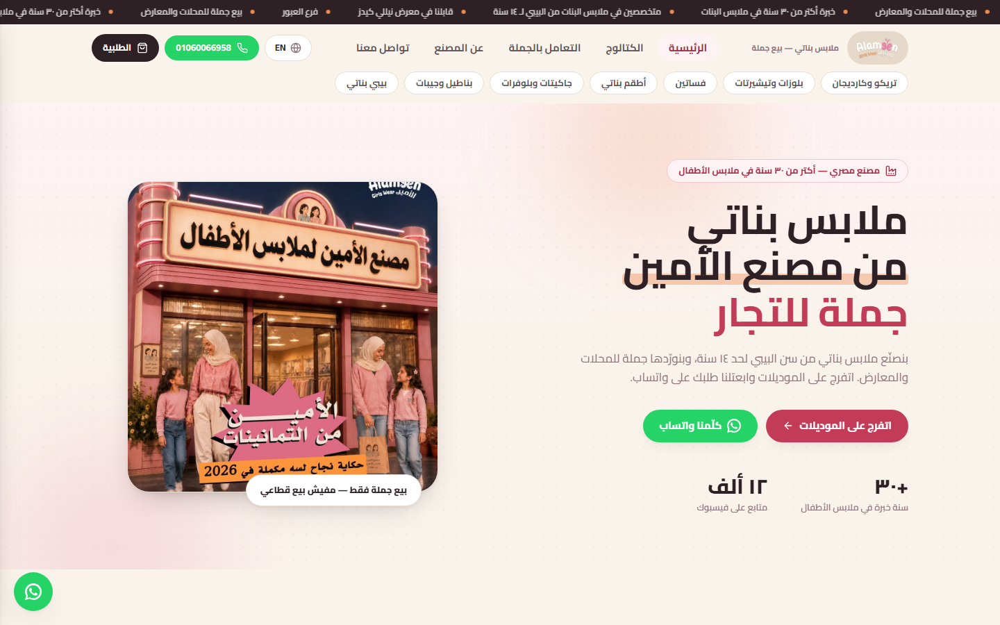
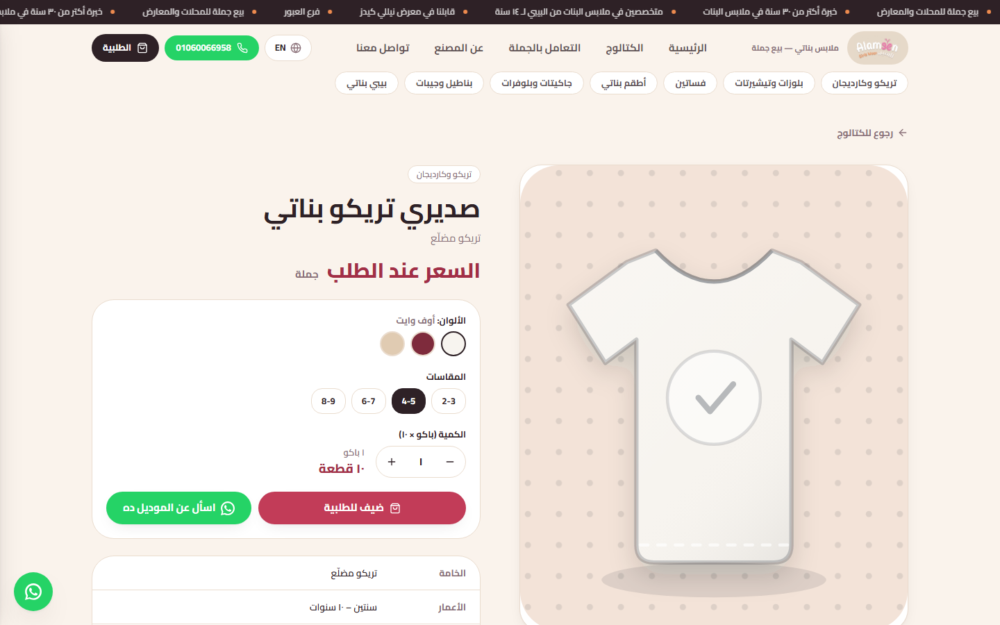
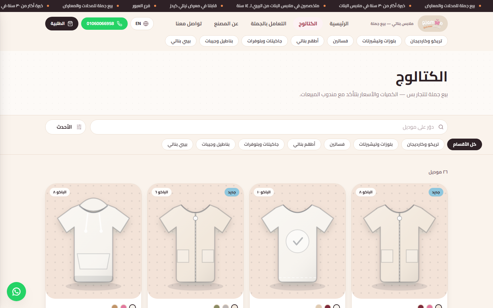
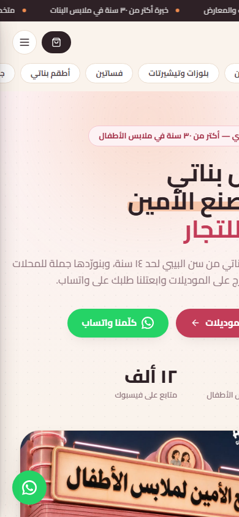

# Alameen: Wholesale Kidswear Catalog

A bilingual (Arabic/English) wholesale catalog website built for **Alameen Girls Wear**, a kidswear manufacturer with 30+ years in business.
Retail buyers browse models, build an order list, and send it to the factory as a ready-formatted WhatsApp message. B2B wholesale runs on WhatsApp, so the site uses that instead of a cart and payment gateway.

> 🧑‍💼 Freelance client project. Built end-to-end by [Ibrahim Ragab](https://github.com/Ebraheem-zydan).
> 🇪🇬 Client handoff and deployment notes (Arabic): [`README.ar.md`](README.ar.md)


| Home | Product page |
|---|---|
|  |  |
| **Catalog** | **Mobile** |
|  |  |

## Features
- **Full RTL/LTR language switching**: Arabic and English from one dictionary (`src/lib/i18n.ts`), with direction-aware layout.
- **Catalog**: search plus category filters that live in the URL (`/catalog?cat=knitwear`), so filtered views can be shared.
- **Product pages**: color and size selection, plus a pack calculator (packs × pieces per pack).
- **Order list**: persisted to `localStorage` through a React context (`src/lib/store.tsx`), so it survives reloads.
- **WhatsApp checkout**: `buildOrderMessage()` serializes the order (model, size, color, quantity) into a pre-filled WhatsApp message.
- **Feature flags for the business owner**: prices and minimum order quantity stay hidden until `showPrices` / `showMoq` are enabled in `src/lib/site.ts`.
- **Single source of truth**: all business data (phones, address, hours, stats) lives in one config file.

## Architecture
```
src/
├─ app/            # App Router pages: /, /catalog, /product/[slug], /wholesale, /about, /contact
├─ components/     # header, footer, product-card, order-drawer, garment (SVG fallback art)
└─ lib/
   ├─ data.ts      # categories and product models
   ├─ site.ts      # business config + feature flags
   ├─ i18n.ts      # AR/EN dictionary
   └─ store.tsx    # language + order-list context, WhatsApp message builder
```

## Design decisions
- **Static export (`output: "export"`)**: the client is on shared hosting (Hostinger) with no Node runtime. Pre-rendering every route to plain HTML means no server costs and fast loads.
- **WhatsApp instead of a payment gateway**: the factory's wholesale buyers negotiate quantities and payment with a sales rep. A structured WhatsApp message fits the existing sales process instead of fighting it.
- **No database (yet)**: around 30 models change rarely. The planned next step is a small Node.js/Express API with an admin panel, so the owner can edit products without a rebuild.

## Run locally
```bash
npm install
npm run dev        # http://localhost:3000
npm run build      # static site in out/
```
